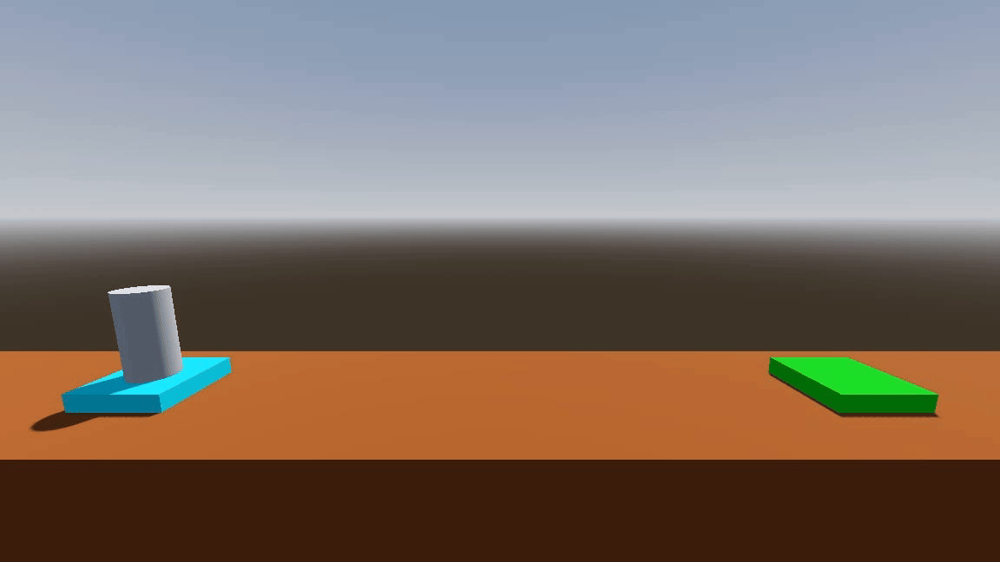

# Lesson 2 Prototype - Rocket Launching



## Project Overview

This project is a prototype for Lesson 2 of a Godot Game Development course. It teaches students the basics of 3D game development using the Godot engine. The lesson covers creating and controlling a player, designing a launching field, implementing physics, and handling collision detection. By the end, students will have a functional rocket-launching game where the player navigates to a landing pad while avoiding hazards.

## Lesson Flow

### Stage 1: Material Distribution

**Tasks:**

- Distribute the GitHub Classroom link to students
- Guide students to import the class project into Godot
- Rename the project name to "Rocket Launching" in `Project > Project Settings > Application > Config > Name`

### Stage 2: Create Player

**Tasks:**

- Create a new 3D scene for the player
- Attach a GDScript to the player node using the `Node: Default` template
- Learn the basic structure of GDScript
- Print "Hello World" in the `_ready()` function

**Changes:**

```yaml
3D Scene:
  name: Player
  script: player.gd
```

- `player.gd`

  ```gdscript
  func _ready():
      print("Hello World")
  ```

### Stage 3: Understand GDScript

**Tasks:**

- Learn about the `delta` parameter in the `_process()` function
- Understand the `Input` class for detecting key presses
- Explore variables in GDScript and how to use them

**Changes:**

- `player.gd`

  ```gdscript
  var time: float = 0.0
  var counter: int = 12

  # Called every frame. 'delta' is the elapsed time since the previous frame.
  func _process(delta: float) -> void:time =
      time = time + delta # test with delta only, may comment out

      print(time)

      if Input.is_action_just_pressed("ui_accept"): # spacebar by defaulted
          counter += 5
          print("counter is ", counter)
  ```

### Stage 4: Control Player

**Tasks:**

- Add environment, lighting, and camera nodes to the player scene
- Enable keyboard controls for the player

**Changes:**

```yaml
3D Scene:
  name: Player
  children:
    - MeshInstance3D:
        mesh:
          type: New cylinder mesh
    - DirectionalLight3D
    - WorldEnvironment
    - Camera3D:
        name: PlayerCamera
        transform:
          position: (0, 0, 5)
          top level: true
```

- `player.gd`
  Remove test code and rewrite as follows:

  ```gdscript
  extends Node3D

  func _process(delta: float) -> void:
      if Input.is_action_pressed("ui_accept"):
          position.y += delta

      if Input.is_action_pressed("ui_left"):
          rotate_z(delta)

      if Input.is_action_pressed("ui_right"):
          rotate_z(-delta)
  ```

### Stage 5: Create Launching Field

**Tasks:**

- Create a new 3D scene for the launching field using CSGBox nodes.

**Changes:**

```yaml
3D Scene:
  name: LaunchingField
  children:
    - CSGBox3D:
        name: Floor
        size: (30, 10, 5)
        material:
          type: New StandardMaterial3D
          albedo:
            color: brown (#8B4513)
        use_collision: true
        transform:
          position: (0, -5, 0)
    - CSGBox3D:
        name: LaunchPad
        size: (2, 0.4, 2)
        material:
          type: New StandardMaterial3D
          albedo:
            color: cyan (#00FFFF)
        use_collision: true
        transform:
          position: (-10, 0.2, 0)
    - CSGBox3D:
        name: LandingPad
        size: (2, 0.4, 2)
        material:
          type: New StandardMaterial3D
          albedo:
            color: green (#00FF00)
        use_collision: true
        transform:
          position: (10, 0.2, 0)
```

### Stage 6: Player Initialisation

**Tasks:**

- Add environment, lighting, and camera nodes to the launching field scene
- Add the player scene to the launching field scene
- Remove environment, lighting, and camera nodes from the player scene
- Set the Main Scene to the launching field scene in `Project > Project Settings > Application > Run > Main Scene`

**Changes:**

```yaml
3D Scene:
  name: LaunchingField
  children:
    - WorldEnvironment
    - DirectionalLight3D
    - Camera3D:
        transform:
          position: (0, 4, 8)
          rotation: (-10, 0, 0)
    - Player: (player.tscn)
        transform:
          position: (-8, 1.4, 0)
```

### Stage 7: Player Physics

**Tasks:**

- Change the player node to a RigidBody3D node and add a collision shape (cylinder)
- Lock the player's linear velocity on the z-axis and angular velocity on the x and y axes
- Add dampening to the player's linear and angular velocity
- Use `apply_central_force()` and `apply_torque()` to simulate forces
- Use `Vector3` and the `basis` property to control force direction

**Changes:**

```yaml
3D Scene:
  name: Player
  type: RigidBody3D
  Linear:
    damp: 1
  angular:
    damp: 3
  Axis Lock:
    linear z: true
    angular x: true
    angular y: true
  children:
    - CollisionShape3D:
        shape:
          type: CylinderShape3D
    - MeshInstance3D:
```

- `player.gd`

  ```gdscript
  extends RigidBody3D

  func _process(delta: float) -> void:
      if Input.is_action_pressed("ui_accept"):
          # apply_central_force(Vector3.UP * delta * 1000) # test with applying force with vector3 up, may comment out
          apply_central_force(basis.y * delta * 1000)

      if Input.is_action_pressed("ui_left"):
          apply_torque(Vector3(0, 0, 100) * delta)

      if Input.is_action_pressed("ui_right"):
          apply_torque(Vector3(0, 0, -100) * delta)
  ```

### Stage 8: Collision Detection

#### Sub-Stage 8.1: Signal Setup

**Tasks:**

- Add the `body_entered` signal to the player node to print the name of the body entered

**Changes:**

```yaml
3D Scene:
    name: Player
    signals:
      - body_entered: .:: _on_body_entered()
    solver:
        - contact motion: true
        - max contacts: 10
```

- `player.gd`

  ```gdscript
  func _on_body_entered(body: Node) -> void:
      print(body.name)
  ```

#### Sub-Stage 8.2: Collision with LaunchPad

**Tasks:**

- Detect collisions between the player and the launch pad by checking `body.name`

**Changes:**

- `player.gd`

  ```gdscript
  func _on_body_entered(body: Node) -> void:
      # print(body.name)

      if body.name == "LandingPad":
            print("You win!")
  ```

#### Sub-Stage 8.3: Collision with Groups

**Tasks:**

- Detect collisions with the landing pad or floor using `body.is_in_group()`

**Changes:**

```yaml
3D Scene:
  name: LaunchingField
  children:
    - CSGBox3D:
        name: Floor
        groups: Hazard
    - CSGBox3D:
        name: LandingPad
        groups: Goal
```

- `player.gd`

  ```gdscript
  func _on_body_entered(body: Node) -> void:
      # print(body.name)

      # if body.name == "LandingPad":

      if body.is_in_group("Goal"):
          print("You win!")

      if body.is_in_group("Hazard"):
          print("You crashed!")
  ```

#### Sub-Stage 8.4: Handling Scene Reload and Quit

**Tasks:**

- Use `call_deferred` to reload the scene or quit the game to avoid `SceneTree` errors

**Changes:**

- `player.gd`

  ```gdscript
    func _on_body_entered(body: Node) -> void:
        # print(body.name)

        # if body.name == "LandingPad":
            #print("You win!")

        if body.is_in_group("Goal"):
            # print("You win!")
            # get_tree().quit()
            complete()

        if body.is_in_group("Hazard"):
            # print("You crashed!")
            # get_tree().reload_current_scene()
            crashed()

    func complete() -> void:
        print("You win!")
        get_tree().quit()

    func crashed() -> void:
        print("You crashed!")
        get_tree().reload_current_scene()
  ```

## Additional Resources

- [Demo Video](project_demo/project_demo.avi)
